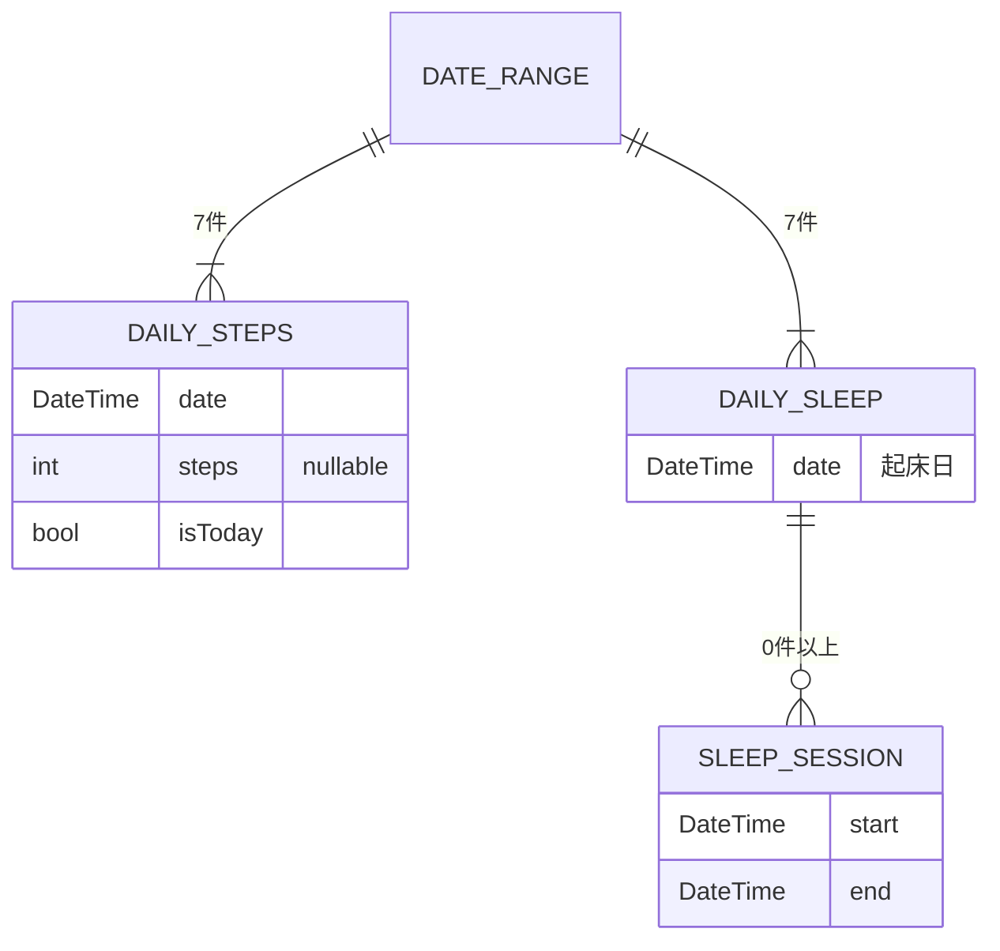
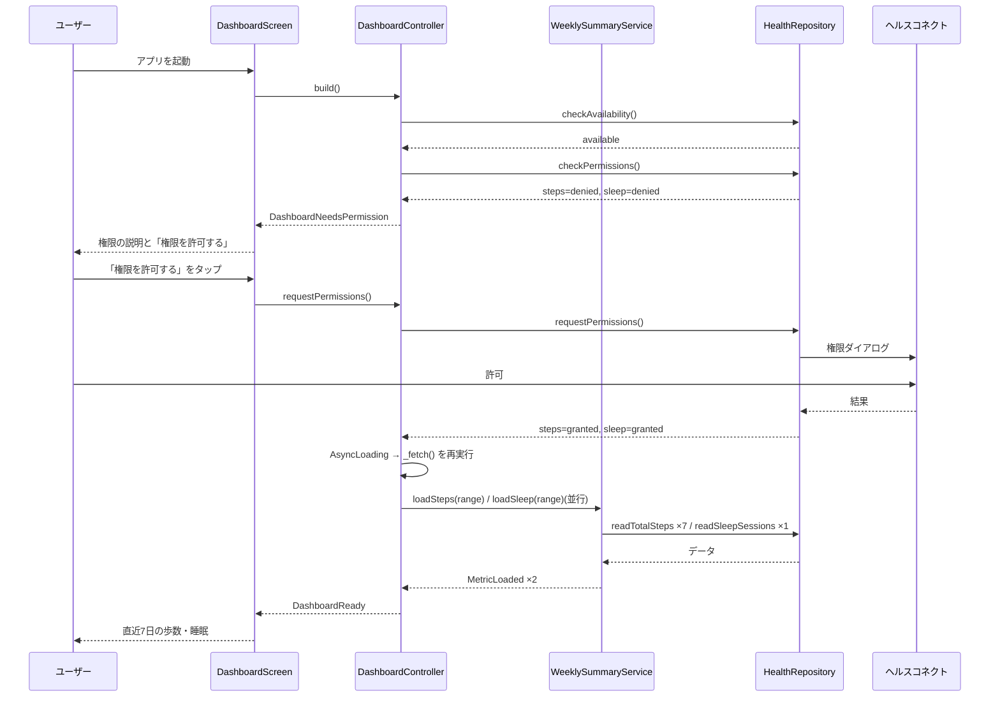
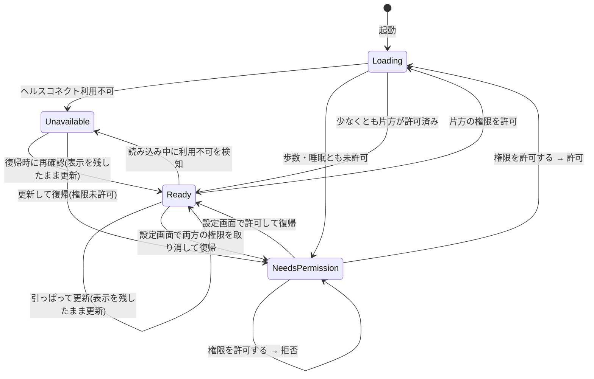

# 機能設計書 (Functional Design Document)

本書は `docs/product-requirements.md`(PRD)の **P0(F1〜F4)** を実現する方法を定義する。P1/P2 は拡張ポイントのみ示し、設計は行わない。

## システム構成図

```mermaid
graph TB
    User[ユーザー]

    subgraph App[health-pixcel(Flutter)]
        UI[プレゼンテーション層<br/>画面・ウィジェット]
        Ctrl[DashboardController<br/>画面状態の管理]
        Svc[WeeklySummaryService<br/>7日分の集計]
        Domain[ドメイン層<br/>モデル・日付計算(純 Dart)]
        RepoIF[HealthRepository<br/>抽象インターフェース]
        RepoHC[HealthConnectRepository<br/>Android 実装]
    end

    Pkg[health パッケージ]
    HC[(ヘルスコネクト)]
    HS[Health Sync 等の書き込み元]

    User --> UI
    UI --> Ctrl
    Ctrl --> Svc
    Ctrl --> RepoIF
    Svc --> RepoIF
    Svc --> Domain
    RepoHC -. implements .-> RepoIF
    RepoHC --> Pkg
    Pkg --> HC
    HS -. 書き込み(アプリの責務外) .-> HC
```

**設計の要点**:
- ヘルスコネクト(Android 固有)に触れるのは `HealthConnectRepository` だけ。上位層は `HealthRepository` 抽象にのみ依存する(PRD「移植性・保守性」)。iOS 対応時は `AppleHealthRepository` を追加して差し替える
- ドメイン層(日付範囲の計算・睡眠の帰属日判定・フォーマット)は Flutter にも `health` にも依存しない純 Dart とし、ユニットテストの主対象にする
- 書き込み元アプリ(`sourceName` / `sourceId`)による分岐は持たない

## 技術スタック

| 分類 | 技術 | 選定理由 |
|------|------|----------|
| 言語 | Dart | Flutter の標準言語。iOS 移行時にコードを流用できる |
| フレームワーク | Flutter | Android / iOS のクロスプラットフォーム。将来の iPhone 移行に備える |
| ヘルスデータ取得 | `health` パッケージ(carp-dk/carp-health-flutter) | ヘルスコネクトと Appleヘルスケアを同一 API で扱える |
| データ保存 | なし(MVP) | 起動・再読み込みのたびにヘルスコネクトから読む(PRD「セキュリティ・プライバシー」) |
| 状態管理 | `architecture.md` で確定 | 本書ではコントローラーの責務と状態の型だけを定義する |
| 日付・数値フォーマット | `intl` パッケージ | 曜日付き日付・3 桁区切りの表示 |

## データモデル定義

`DashboardState`(プレゼンテーション層の `lib/presentation/dashboard/dashboard_state.dart` に置く)以外はすべてドメイン層の不変クラス。いずれも健康データの値を含むため `toString()` を独自実装しない(誤ってログに出したときに値が出ないようにする。詳細は「セキュリティ考慮事項」)。

### エンティティ: DateRange(直近 7 日の範囲)

```dart
/// 直近 7 日(今日を含む)を表す。日付はローカルタイムゾーンの 00:00。
class DateRange {
  final DateTime now;              // 範囲を決めた時点の現在時刻(ローカル)。読み取りの終端に使う
  final DateTime today;            // 今日の 00:00(ローカル)
  final List<DateTime> days;       // 新しい順の 7 日分 [today, today-1, ..., today-6]

  DateTime get oldestDay;          // today - 6 日
}
```

**制約**:
- `days.length == 7`、要素は時刻 00:00 のローカル `DateTime`
- 1 回の読み込みでは時計を 1 回だけ読み、`today` と読み取りの終端(`now`)を同じ時刻から決める(0 時をまたいだときに「今日」と終端がずれないようにするため)
- 「1 日前」は `DateTime(y, m, d - 1)` で求める(`subtract(Duration(days: 1))` は夏時間をまたぐと 00:00 からずれるため使わない)

### エンティティ: DailySteps(日別歩数)

```dart
class DailySteps {
  final DateTime date;    // 対象日の 00:00(ローカル)
  final int? steps;       // その日の歩数合計。null = 記録なし
  final bool isToday;     // true の場合、表示時点までの途中値
}
```

**制約**:
- `steps` は `null` または 1 以上。取得値が 0 の場合も `null`(記録なし)として扱う(「アルゴリズム設計」参照)

### エンティティ: SleepSession(睡眠セッション)

```dart
class SleepSession {
  final DateTime start;   // 就寝時刻(ローカル)
  final DateTime end;     // 起床時刻(ローカル)

  Duration get duration => end.difference(start);
}
```

**制約**:
- `end` が `start` より後であること。満たさないセッションは取得時に破棄する(PRD「信頼性」: 不完全なデータでクラッシュしない)

### エンティティ: DailySleep(日別睡眠)

```dart
class DailySleep {
  final DateTime date;                 // 帰属日(起床日)の 00:00(ローカル)
  final List<SleepSession> sessions;   // 就寝時刻の昇順。空 = 記録なし

  bool get hasRecord => sessions.isNotEmpty;
  Duration get total;                  // sessions の duration の合計
}
```

### エンティティ: 取得結果と権限状態

```dart
/// 歩数・睡眠それぞれの権限状態
enum PermissionStatus { granted, denied }

/// ヘルスコネクト自体の利用可否
enum HealthAvailability {
  available,          // 利用可能
  notInstalled,       // 利用不可(minSdk 34 では OS 統合のため通常は起こらない。防御的に扱う)
  updateRequired,     // ヘルスコネクトの更新が必要
}

/// アプリの起動理由(起動インテントの action から決まる)
enum LaunchAction {
  normal,                 // ランチャー等からの通常起動
  permissionRationale,    // ヘルスコネクトの権限画面から「利用目的」を開いた
}

/// 1 データ種別ぶんの取得結果
sealed class MetricResult<T> {}
class MetricLoaded<T> extends MetricResult<T> { final List<T> days; }  // 7 件、新しい順
class MetricPermissionDenied<T> extends MetricResult<T> {}
class MetricFailed<T> extends MetricResult<T> { final HealthErrorKind kind; }

enum HealthErrorKind { unavailable, readFailed }
```

### エンティティ: DashboardState(画面状態)

読み込み中は `DashboardState` のサブクラスではなく、Riverpod の `AsyncLoading`(値なし)で表す(「DashboardController」参照)。

```dart
sealed class DashboardState {}

/// ヘルスコネクトが使えない(F4)
class DashboardUnavailable extends DashboardState {
  final HealthAvailability availability;   // notInstalled / updateRequired
}

/// 歩数・睡眠の両方が未許可(F4)。初回起動直後もここ
class DashboardNeedsPermission extends DashboardState {}

/// 少なくとも片方が許可済み(F2 / F3 / F4)
class DashboardReady extends DashboardState {
  final DateRange range;
  final MetricResult<DailySteps> steps;
  final MetricResult<DailySleep> sleep;

  /// F4 のデータなし案内を出すかどうか
  bool get isAllEmpty;
}
```

**`isAllEmpty` の定義**: 次の 3 条件をすべて満たすとき `true`。
1. `steps` / `sleep` のどちらも `MetricFailed` ではない
2. 少なくとも一方が `MetricLoaded`
3. `MetricLoaded` であるものはすべて、7 日とも記録なし(歩数は `steps == null`、睡眠は `hasRecord == false`)

`MetricPermissionDenied` の種別は判定から除外する(例: 歩数が未許可、睡眠が 7 日とも記録なし → `true`)。

### ER図



永続化はしないため、これらはメモリ上の値オブジェクトであり ID を持たない。

## コンポーネント設計

### HealthRepository(データ層・抽象)

**責務**:
- ヘルスデータ基盤の利用可否・権限状態の確認と権限リクエスト
- 指定期間の歩数合計・睡眠セッションの読み取り
- プラットフォーム固有の例外を `HealthErrorKind` に変換する(上位層にプラグインの例外型を漏らさない)

**インターフェース**:
```dart
abstract interface class HealthRepository {
  Future<HealthAvailability> checkAvailability();

  /// 歩数・睡眠それぞれの権限状態
  Future<({PermissionStatus steps, PermissionStatus sleep})> checkPermissions();

  /// 歩数・睡眠の READ 権限をまとめてリクエストし、リクエスト後の状態を返す
  Future<({PermissionStatus steps, PermissionStatus sleep})> requestPermissions();

  /// ヘルスコネクトのアプリ権限設定画面を開く(ダイアログが出なくなった場合の逃げ道)。
  /// 開けなかった場合は false を返す
  Future<bool> openPermissionSettings();

  /// ヘルスコネクトの入手・更新ページ(Play ストア)を開く。開けなかった場合は false を返す
  Future<bool> openHealthConnectStore();

  /// [start, end) の歩数合計。記録なしは null。失敗時は HealthReadException を投げる
  Future<int?> readTotalSteps(DateTime start, DateTime end);

  /// [start, end) と重なる睡眠セッション。失敗時は HealthReadException を投げる
  Future<List<SleepSession>> readSleepSessions(DateTime start, DateTime end);
}

class HealthReadException implements Exception {
  const HealthReadException(this.kind);
  final HealthErrorKind kind;   // メッセージに健康データの値を含めない
}
```

**依存関係**: なし(抽象)

### HealthConnectRepository(データ層・Android 実装)

**責務**: `HealthRepository` を `health` パッケージで実装する

| メソッド | 使う `health` API | 補足 |
|---|---|---|
| `checkAvailability` | `getHealthConnectSdkStatus()` | `sdkAvailable` → `available`、`sdkUnavailableProviderUpdateRequired` → `updateRequired`、それ以外(`sdkUnavailable`)・`null` → `notInstalled` |
| `checkPermissions` | `hasPermissions([STEPS])` / `hasPermissions([SLEEP_SESSION])`(各 `READ`) | 種別ごとに個別に呼ぶ(片方だけ許可を判別するため)。`null`/`false` は `denied` |
| `requestPermissions` | `requestAuthorization([STEPS, SLEEP_SESSION], permissions: [READ, READ])` | 戻り値の bool は使わず、直後に `checkPermissions()` を呼んで種別ごとの状態を返す |
| `openPermissionSettings` | 自作 MethodChannel `health_pixcel/health_connect_settings` の `open` | Kotlin 側の手順は `architecture.md`「ヘルスコネクトの設定画面を開く」 |
| `openHealthConnectStore` | `installHealthConnect()` | Play ストアのヘルスコネクトのページを開く(更新にも使う)。例外が出たら `false` を返す |
| `readTotalSteps` | `getTotalStepsInInterval(start, end)` | ヘルスコネクトの集計 API を使うため、複数ソースの重複除外はヘルスコネクト側で行われる。`null` と `0` は記録なしとして `null` を返す |
| `readSleepSessions` | `getHealthDataFromTypes(types: [SLEEP_SESSION], startTime, endTime)` | 各 `HealthDataPoint` の `dateFrom`/`dateTo` を `toLocal()` して `SleepSession` に変換。`dateTo <= dateFrom` は破棄 |

- `UnsupportedError`(ヘルスコネクト利用不可)→ `HealthReadException(unavailable)`、`HealthException` などその他の例外 → `HealthReadException(readFailed)`
- 例外を変換するとき、元の例外メッセージやデータ点をログに出さない
- `Health().configure()` は `HealthConnectRepository` の内部で 1 回だけ呼ぶ: フィールド `late final Future<void> _configured = _health.configure();` を持ち、各公開メソッドの先頭で `await _configured;` する(`late final` のため初回アクセス時に 1 度だけ実行される)。`main.dart` は `health` を import しない

**依存関係**: `health` パッケージ

### WeeklySummaryService(アプリケーション層)

**責務**:
- 今日の日付から `DateRange` を作る
- リポジトリから 7 日分を読み、`DailySteps` / `DailySleep` の 7 件リストに組み立てる
- 歩数・睡眠を**独立に**取得し、片方の失敗がもう片方の表示を妨げないようにする

**インターフェース**:
```dart
class WeeklySummaryService {
  WeeklySummaryService(this._repository, this._clock);

  final HealthRepository _repository;
  final DateTime Function() _clock;   // テストで「今日」を固定するため注入する

  /// 時計を 1 回だけ読んで DateRange を作る
  DateRange currentRange();

  /// 読み取りの終端には range.now を使い、時計を読み直さない
  Future<MetricResult<DailySteps>> loadSteps(DateRange range);
  Future<MetricResult<DailySleep>> loadSleep(DateRange range);
}
```

- `HealthReadException(kind)` は `MetricFailed(kind)` に変換して返す(`unavailable` もそのまま返し、画面状態への反映は `DashboardController` が行う)

**依存関係**: `HealthRepository`、ドメイン層の関数(`buildDateRange` / `assignSleepToDays`)

### DashboardController(プレゼンテーション層・状態管理)

**責務**:
- 起動時・再読み込み時の状態遷移を管理し、画面状態を公開する
- 権限状態に応じて、許可済みの種別だけを `WeeklySummaryService` で読み込む
- 権限リクエストの起動と、許可直後の再読み込み(F1: 再起動不要)
- アプリがフォアグラウンドに戻ったとき(設定画面から戻った場合など)に権限状態を再確認する

**インターフェース**(Riverpod の `AsyncNotifier<DashboardState>`。公開される `state` の型は `AsyncValue<DashboardState>`):
```dart
class DashboardController extends AsyncNotifier<DashboardState> {
  @override
  Future<DashboardState> build();      // 初回読み込み(= _fetch())

  Future<void> refresh();              // 引っぱって更新・「再読み込み」操作
  Future<void> requestPermissions();   // 「権限を許可する」操作
  Future<void> openSettings();         // 「ヘルスコネクトの設定を開く」操作
  Future<void> openStore();            // 「ヘルスコネクトを更新する」操作
  Future<void> onResumed();            // フォアグラウンド復帰時

  // private
  Future<DashboardState> _fetch({bool force = false});  // 利用可否 → 権限 → 読み込み → DashboardState を組み立てる
  Future<DashboardState>? _inFlight;   // 実行中の _fetch(多重実行の抑止)
  bool _requestingPermission = false;  // 権限ダイアログ表示中
  _Snapshot? _lastSnapshot;            // 直近の _fetch が最終的に採用した利用可否・権限状態
}

/// 利用可否が available 以外のときは権限を取得しないため null
typedef _Snapshot = ({
  HealthAvailability availability,
  ({PermissionStatus steps, PermissionStatus sleep})? permissions,
});
```

**依存の取得**: `HealthRepository` / `WeeklySummaryService` は、各メソッドの中で `ref.read(healthRepositoryProvider)` / `ref.read(weeklySummaryServiceProvider)` で取得する(これらは不変のため `watch` しない。`watch` すると依存の再生成で Notifier が作り直され、`_inFlight` などの private 状態が失われる)。

**状態遷移の規則**:

| 操作 | `state` の変化 |
|---|---|
| `build()`(初回) | `AsyncLoading`(値なし)→ `AsyncData(_fetch() の結果)` |
| `refresh()` | **前回の値を表示したまま** `_fetch()` を実行し、完了したら `AsyncData(新しい値)` に置き換える(全画面のローディングには戻さない)。引っぱって更新の `RefreshIndicator` はこの Future の完了を待つ |
| `requestPermissions()` | `_requestingPermission = true` → `repository.requestPermissions()` を `try` / `finally` で囲み、`finally` で必ず `false` に戻す → `AsyncLoading`(値なし)→ `AsyncData(_fetch(force: true) の結果)`。`repository.requestPermissions()` が例外を投げても画面状態はエラーにせず、そのまま `_fetch(force: true)` に進む(権限状態を読み直して表示する) |
| `onResumed()` | `_requestingPermission` が `true` なら何もしない(権限ダイアログから戻った時の復帰は `requestPermissions()` 側で処理するため)。それ以外は現在の利用可否を `checkAvailability()` で取り、`available` のときだけ `checkPermissions()` も呼んで `_Snapshot` を作る。`_lastSnapshot` と異なれば(`_lastSnapshot` が `null` の場合も含む)`refresh()` を呼ぶ。確認中に例外が出たら `refresh()` を呼ぶ |
| `openSettings()` | `repository.openPermissionSettings()` が `false` を返したら、`ScaffoldMessenger` で「ヘルスコネクトを開けませんでした」を表示する(状態は変えない)。戻ってきたときの反映は `onResumed()` に任せる |
| `openStore()` | `repository.openHealthConnectStore()` が `false` を返したら、スナックバー「Play ストアを開けませんでした」を表示する(状態は変えない)。戻ってきたときの反映は `onResumed()` に任せる |

**`_fetch({force})` の多重実行の扱い**:
- `force == false` で `_inFlight` が実行中 → その Future を返す(合流する。引っぱって更新の連打や復帰の重なり向け)
- `force == true` で `_inFlight` が実行中 → その完了を待ってから(結果は捨てる)新たに実行する(権限リクエスト直後に、許可前に始まった古い読み込み結果を使わないため)
- 新たに実行するときは、その Future を `_inFlight` に入れ、`whenComplete` で「`_inFlight` が自分自身なら `null` に戻す」

**`_fetch()` の本体の手順**:
1. `checkAvailability()` が `available` 以外 → `_lastSnapshot = (availability, permissions: null)` として `DashboardUnavailable(availability)` を返す
2. `checkPermissions()` を呼び、`_lastSnapshot = (available, permissions)` に更新する
3. 両方 `denied` → `DashboardNeedsPermission` を返す
4. `currentRange()` で範囲を決め、許可済みの種別だけ `loadSteps` / `loadSleep` を並行実行する(未許可の種別は `MetricPermissionDenied`)
5. どちらかが `MetricFailed(unavailable)` なら `checkAvailability()` を再確認する。`available` 以外なら `_lastSnapshot = (availability, permissions: null)` として `DashboardUnavailable(availability)` を返す。`available` のままなら `MetricFailed(readFailed)` に読み替えて次へ進む
6. `DashboardReady(range, steps, sleep)` を返す
7. 1〜6 のどこで想定外の例外が出ても捕捉し、`_lastSnapshot = null` にしたうえで `DashboardReady(range, MetricFailed(readFailed), MetricFailed(readFailed))` を返す(範囲が未確定なら `currentRange()` で作る。`_lastSnapshot = null` により次の復帰で必ず再読み込みされる)。値をログに出さない

**`_lastSnapshot` の不変条件**: `_fetch()` が値を返した時点で、`_lastSnapshot` はその戻り値を決めたときの利用可否・権限状態と一致している(どの出口から返った場合も)。

`_fetch()` が例外を外に出さないため、`AsyncError` は通常発生しない。万一発生した場合、画面は「データを読み込めませんでした」+「再読み込み」を表示する。

**依存関係**: `HealthRepository`、`WeeklySummaryService`

### 画面・ウィジェット(プレゼンテーション層)

| コンポーネント | 責務 |
|---|---|
| `DashboardScreen` | 唯一の画面。`DashboardState` に応じて以下を出し分ける |
| `StepsSection` | `MetricResult<DailySteps>` を受け取り、7 行の一覧・未許可案内・エラー表示のいずれかを描画 |
| `SleepSection` | `MetricResult<DailySleep>` を受け取り、同上 |
| `StatusMessage` | 案内・エラーの共通表示(見出し + 説明 + 操作ボタン) |
| `PermissionRationaleScreen` | 権限の利用目的の説明画面(ヘルスコネクトから「利用目的」を開いたときの表示先。案内画面の「詳しく見る」からも開く) |
| `HealthPixcelApp`(`app.dart`) | `launchActionProvider` を見て最初の画面を決める(`permissionRationale` → `PermissionRationaleScreen`、それ以外 → `DashboardScreen`)。判定中は空の `Scaffold` を表示する |

ウィジェットは状態の表示だけを担い、日付計算・フォーマット以外のロジックを持たない。

### 起動理由の取得(LaunchAction)

- `lib/data/platform_channels.dart` の `LaunchChannel.getLaunchAction()` が MethodChannel `health_pixcel/launch` の `getLaunchAction` を呼び、`LaunchAction` を返す(失敗時は `normal`)
- 画面からは `lib/presentation/providers.dart` の `launchActionProvider`(`FutureProvider<LaunchAction>`)経由でのみ参照する(`app.dart` が `lib/data/` を直接 import しないため)
- **MVP ではコールドスタート時の起動インテントだけを扱う**。アプリが既に起動している状態で「利用目的」を開かれた場合(`onNewIntent`)は扱わず、ダッシュボードが前面に出るだけとする

### PermissionRationaleScreen の内容

見出し「健康データの利用について」。本文は次の箇条書き:

- 読み取るデータ: 歩数・睡眠(就寝・起床時刻)
- 使い道: 直近 7 日の歩数と睡眠を、このアプリの画面に表示するためだけに使います
- 送信: データを端末の外に送信しません(このアプリはインターネットに接続する権限を持っていません)
- 保存・書き込み: データをアプリ内に保存せず、ヘルスコネクトへの書き込みも行いません
- 取り消し: 権限はヘルスコネクトの設定からいつでも取り消せます

操作は「閉じる」のみ:
- `LaunchAction.permissionRationale` で起動された場合 → `SystemNavigator.pop()` でアプリを閉じ、ヘルスコネクトに戻る
- 案内画面の「詳しく見る」から開いた場合 → `Navigator.pop()` で元の画面に戻る

## ユースケース図

### UC1: 初回起動〜権限許可〜表示(F1 → F2 / F3)



**フロー説明**:
1. 起動時にヘルスコネクトの利用可否 → 権限状態の順に確認する
2. 両方未許可なら案内画面を出し、ユーザー操作で権限ダイアログを開く(起動直後に自動でダイアログを出さない。何のための権限かを先に見せるため)
3. 許可されたら同じ画面のまま `_fetch()` を再実行し、データを表示する

### UC2: 2 回目以降の起動(F1 / F2 / F3)

1. `build()` → `checkAvailability()` → `checkPermissions()` で許可済みを確認(ダイアログは出さない)
2. 許可済みの種別だけ `WeeklySummaryService` で読み込み、`DashboardReady` を表示する

### UC3: 片方だけ許可(F4)

1. `checkPermissions()` が `steps=granted, sleep=denied` を返す
2. 歩数だけ読み込み、`DashboardReady(steps: MetricLoaded, sleep: MetricPermissionDenied)` とする
3. 睡眠セクションにだけ未許可の案内と「権限を許可する」を表示する

### UC4: 再読み込み・フォアグラウンド復帰

- 画面のプルダウン(引っぱって更新)で `refresh()` を呼ぶ(前回の表示を残したまま更新する)
- `AppLifecycleListener(onResume:)` で `onResumed()` → 利用可否・権限状態が前回と変わっていれば `refresh()` を呼ぶ(ヘルスコネクトの設定画面で許可して戻ってきた場合に対応)。権限ダイアログ表示中の復帰は無視する(`requestPermissions()` と二重に読み込まないため)

## 画面遷移図

画面は `DashboardScreen` 1 つで、状態によって表示が切り替わる。`PermissionRationaleScreen` はヘルスコネクトの権限画面から「利用目的」を開いたときだけ表示される。



- `Loading` は `AsyncLoading`(値なし)。それ以外は `AsyncData` の中身の `DashboardState`
- 復帰時・引っぱって更新では `Loading` を経由しない(`refresh()`)
- 引っぱって更新(`RefreshIndicator`)は `Ready` / `NeedsPermission` / `Unavailable` のすべてで有効にする。案内表示だけの画面でも引っぱれるよう、本文を `ListView`(`AlwaysScrollableScrollPhysics`)に入れる
- `Ready` の中の表示は `MetricResult` の組み合わせで決まる(「UI設計」参照)

## アルゴリズム設計

### A1. 直近 7 日の日付範囲の計算

**目的**: 「今日を含む 7 日」をローカル日付で求める

```dart
DateRange buildDateRange(DateTime now) {
  final local = now.toLocal();
  final today = DateTime(local.year, local.month, local.day);
  final days = [
    for (var i = 0; i < 7; i++) DateTime(today.year, today.month, today.day - i),
  ];
  return DateRange(now: local, today: today, days: days);
}

/// その日の終わり(翌日 00:00)。読み取り区間 [day, nextDay(day)) に使う
DateTime nextDay(DateTime day) => DateTime(day.year, day.month, day.day + 1);
```

### A2. 日別歩数の取得

**目的**: 7 日分の日別歩数を、記録なしと区別して取得する

1. `range.days` の各日 `d` について `readTotalSteps(d, nextDay(d))` を呼ぶ。ただし今日は終端を `range.now` にする
2. 7 回の呼び出しは `Future.wait` で並行に実行する
3. 戻り値が `null` → `DailySteps(steps: null)`(記録なし)
4. 1 日でも `HealthReadException` が出た場合は、歩数全体を `MetricFailed` にする(部分的な表示はしない。欠けた日を「記録なし」と誤表示しないため)

**0 を記録なしとする理由**: ヘルスコネクトの集計 API は記録が 1 件もない区間で 0 を返す場合があり、「0 歩」と「記録なし」を区別できない。ウォッチを装着していれば 0 歩の日は実質的に起こらないため、0 は記録なしとして表示する。

### A3. 睡眠セッションの帰属日判定

**目的**: 睡眠セッションを起床日(終了時刻のローカル日付)に振り分ける(PRD「共通の定義」)

1. 読み取り区間: `[range.oldestDay - 1 日の 00:00, range.now]`。最古の日に起床したセッションは前日夜に始まるため、1 日前から読む。区間の開始より前に始まるセッション(最古日に起床し、開始が前々日以前 = 24 時間を大きく超える睡眠)は対象外になるが、記録の異常として扱い許容する
2. 取得したセッションを `end` のローカル日付でグループ化する
3. `range.days` に含まれない日付(最古日より前に起床したもの)は捨てる
4. 各日のセッションを `start` の昇順に並べる
5. 同一の `start`/`end` を持つセッションが複数ある場合は 1 件にまとめる(書き込み元の重複対策。`sourceName` は見ない)
6. 7 日分すべてについて `DailySleep` を作る(セッションがない日は `sessions: []`)

```dart
List<DailySleep> assignSleepToDays(DateRange range, List<SleepSession> sessions) {
  final unique = {for (final s in sessions) (s.start, s.end): s}.values;
  final byDay = <DateTime, List<SleepSession>>{};
  for (final s in unique) {
    final e = s.end.toLocal();
    final day = DateTime(e.year, e.month, e.day);
    byDay.putIfAbsent(day, () => []).add(s);
  }
  return [
    for (final d in range.days)
      DailySleep(
        date: d,
        sessions: (byDay[d] ?? [])..sort((a, b) => a.start.compareTo(b.start)),
      ),
  ];
}
```

**睡眠時間**: `SleepSession.duration = end − start`(覚醒時間を差し引かない)。日別の合計は `DailySleep.total`。HUAWEIヘルスケアの表示と差がある場合の見直しは PRD「未確定事項」で扱う。

### A4. 表示フォーマット

| 対象 | 形式 | 例 |
|---|---|---|
| 日付 | `M/d(E)`(`intl`、ロケール `ja`) | `10/6(火)`(2026-10-06 は火曜日) |
| 今日・昨日 | 日付の前に「今日」「昨日」を付ける | `今日 10/6(火)` |
| 歩数 | 3 桁区切り + 「歩」 | `8,432 歩` |
| 時刻 | `HH:mm`(24 時間表記・ゼロ埋め) | `23:45` / `06:57` |
| 時間 | `H時間m分`。1 時間未満は `m分`、分が 0 のときは `H時間` | `7時間12分` / `45分` / `8時間` |

- `intl` の `ja` ロケールの日付データは、`main()` で `runApp` の前に `await initializeDateFormatting('ja')` を呼んで読み込む。テストでは `setUpAll` で同じ呼び出しを行う
- テストの期待値の曜日は、実際の暦どおりに書く(2026-10-04 = 日、10-05 = 月、10-06 = 火)

## UI設計

### 画面レイアウト(DashboardReady)

```
┌────────────────────────────────┐
│ health-pixcel                  │
├────────────────────────────────┤
│ 睡眠                            │
│ 今日 10/6(火)  23:45→06:57 7時間12分 │
│ 昨日 10/5(月)  00:10→07:20 7時間50分 │  ← 日別合計
│                13:00→13:40          │  ← 同日の2件目
│ 10/4(日)       記録なし             │
│ …(7行)                          │
├────────────────────────────────┤
│ 歩数                            │
│ 今日 10/6(火)   3,210 歩 (途中)     │
│ 昨日 10/5(月)   8,432 歩           │
│ 10/4(日)        記録なし           │
│ …(7行)                          │
└────────────────────────────────┘
```

- 朝に確認することが多い(PRD ペルソナ)ため、**睡眠を上、歩数を下**に置く
- 両セクションとも新しい日が上。Pixel 10 の縦画面でスクロールせずに少なくとも今日〜直近数日分が見えること

### 表示項目

**睡眠セクション(1 日 1 行。複数セッションは行内に追記)**

| 項目 | 説明 | フォーマット |
|------|------|-------------|
| 日付 | 帰属日(起床日) | A4 の日付形式 |
| 就寝→起床 | 各セッションの開始・終了 | `HH:mm→HH:mm` |
| 睡眠時間 | 日別合計(複数セッション時) | A4 の時間形式 |

**歩数セクション(1 日 1 行)**

| 項目 | 説明 | フォーマット |
|------|------|-------------|
| 日付 | 対象日 | A4 の日付形式 |
| 歩数 | 日別合計。今日は「(途中)」を付ける | A4 の歩数形式 |

### 状態別の表示

| 状態 | 表示 | 操作 |
|---|---|---|
| `AsyncLoading`(値なし) | ローディングインジケーター | なし |
| `DashboardUnavailable(notInstalled)` | 「ヘルスコネクトを利用できません」+「Play ストアでヘルスコネクトの状態を確認してください」 | 「Play ストアを開く」(`openStore()`) |
| `DashboardUnavailable(updateRequired)` | 「ヘルスコネクトの更新が必要です」 | 「ヘルスコネクトを更新する」(`openStore()`) |
| `DashboardNeedsPermission` | 「歩数と睡眠を表示するには、ヘルスコネクトの読み取り権限が必要です。データの読み取りのみ行い、端末の外には送信しません」 | 「権限を許可する」/「ヘルスコネクトの設定を開く」/「詳しく見る」(`PermissionRationaleScreen` へ) |
| `Ready` + セクションが `MetricPermissionDenied` | そのセクション内に「[歩数/睡眠] の権限が許可されていません」 | 「権限を許可する」/「ヘルスコネクトの設定を開く」 |
| `AsyncError`(通常発生しない) | 「データを読み込めませんでした」 | 「再読み込み」(`refresh()`) |
| `Ready` + セクションが `MetricFailed` | そのセクション内に「データを読み込めませんでした」 | 「再読み込み」 |
| `Ready` + `isAllEmpty` | 画面上部に「ヘルスコネクトにデータがありません。Health Sync の同期設定を確認してください」 | 「再読み込み」(各セクションは 7 行とも「記録なし」で表示) |

- 権限ダイアログを 2 回拒否するとヘルスコネクトはダイアログを出さなくなるため、「権限を許可する」が効かないときの逃げ道として「ヘルスコネクトの設定を開く」を常に併記する

### カラーコーディング

- 「記録なし」「(途中)」は本文より弱い色(`onSurfaceVariant` 相当)で表示し、値のある行と区別する
- エラー・案内は `docs/ui-design-guidelines.md` の基準に従い、色だけに頼らず文言で状態を伝える
- 具体的な配色は `docs/ui-design-guidelines.md` §7 の記入(`/kickoff` フェーズ1.5)に従う

## ファイル構造

MVP では健康データをファイル・データベースに保存しない。アプリが書き出すファイルはない。

## パフォーマンス最適化

- **歩数の 7 回呼び出しを並行実行**: `Future.wait` で並べる(A2)
- **歩数と睡眠を並行取得**: `loadSteps` と `loadSleep` を同時に開始する
- **睡眠は 1 回のクエリ**: 8 日分を 1 回で取得し、端末内で振り分ける(A3)
- 目標: 起動から表示まで 3 秒以内、再読み込みは 2 秒以内(PRD「パフォーマンス」)

## セキュリティ考慮事項

- **INTERNET 権限の排除**: `android/app/src/release/AndroidManifest.xml` に `<uses-permission android:name="android.permission.INTERNET" tools:node="remove"/>` を置き、依存パッケージ経由の混入もマージ時に除去する。リリースビルドの最終マニフェストで不在を確認する(手順は `development-guidelines.md`)。デバッグ/プロファイルではホットリロード等のため INTERNET が入ってよい
- **最小権限**: ヘルスコネクト権限は `android.permission.health.READ_STEPS` と `android.permission.health.READ_SLEEP` のみ宣言する。`health` パッケージが要求する場合を除き、`ACTIVITY_RECOGNITION` 等の追加権限は宣言しない(必要性は実装時に確認し、必要なら PRD に理由を追記する)
- **ログ出力の禁止**: 健康データの値(歩数・時刻・時間)を `print` / `debugPrint` / `log` に渡さない。ドメインモデルは `toString()` を実装しない。例外メッセージにも値を含めない
- **保存・共有の禁止**: ファイル書き出し・共有シート・クリップボードコピーを実装しない
- **権限の利用目的表示**: ヘルスコネクトの要件に従い、`ACTION_SHOW_PERMISSIONS_RATIONALE` と(Android 14 以降の)`VIEW_PERMISSION_USAGE` の表示先として `PermissionRationaleScreen` を用意する。マニフェストの具体的な記述は `architecture.md` で定義する

## エラーハンドリング

### エラーの分類

| エラー種別 | 発生箇所 | 処理 | ユーザーへの表示 |
|-----------|---------|------|-----------------|
| ヘルスコネクト利用不可 | `checkAvailability`、または読み込み中の `UnsupportedError`(→ `MetricFailed(unavailable)`) | `DashboardUnavailable` に遷移(後者は `_fetch()` 本体の手順 5 で利用可否を再確認してから) | 「ヘルスコネクトを利用できません」/「更新が必要です」 |
| 権限未許可(両方) | `checkPermissions` | 読み込みをしない。`DashboardNeedsPermission` | 権限の説明 + 「権限を許可する」 |
| 権限未許可(片方) | `checkPermissions` | 許可済みの種別だけ読む | 該当セクションに未許可の案内 |
| 権限ダイアログで拒否 | `requestPermissions` | 状態を再確認して表示を更新(エラーにはしない) | 未許可の案内のまま |
| 読み取り失敗 | `readTotalSteps` / `readSleepSessions` | 該当種別を `MetricFailed(readFailed)` にする。もう片方は表示を続ける | 該当セクションに「データを読み込めませんでした」+「再読み込み」 |
| 不正なセッション(`end <= start`) | `HealthConnectRepository` の変換 | 破棄する(エラーにしない) | 該当日に他のセッションがなければ「記録なし」 |
| 想定外の例外 | どこでも | `_fetch()` の最上位で捕捉し、両種別を `MetricFailed(readFailed)` にする。値をログに出さない | 「データを読み込めませんでした」 |
| 設定画面を開けない | `openPermissionSettings` が `false` | 状態は変えない | スナックバー「ヘルスコネクトを開けませんでした」 |
| Play ストアを開けない | `openHealthConnectStore` が `false` | 状態は変えない | スナックバー「Play ストアを開けませんでした」 |
| 権限リクエストの失敗 | `requestPermissions` の例外 | フラグを戻し、権限状態を読み直して表示する(エラー表示にはしない) | 未許可の案内のまま |

## テスト戦略

### ユニットテスト(`flutter test`)
- `buildDateRange`: 通常日・月またぎ・年またぎ・23:59 で 7 日が 00:00 に揃い、`now` が保持される(夏時間の検証は任意。対象端末の日本には夏時間がないため、`DateTime(y, m, d ± n)` を使う規約で担保する)
- `assignSleepToDays`: 日付をまたぐ睡眠が起床日に入る / 最古日より前に起床したセッションが除外される / 同日 2 件(昼寝)が昇順に並ぶ / 重複セッションが 1 件になる / セッションがない日が空リストになる
- A4 のフォーマット関数(`7時間12分` / `45分` / `8,432 歩` / `今日 10/6(火)`。2026-10-06 基準)
- `WeeklySummaryService`: フェイクの `HealthRepository` と固定時計で、歩数の `null`/`0` → 記録なし、1 日失敗 → `MetricFailed`、今日の終端が `range.now` になること、時計が 1 回しか読まれないこと
- `DashboardController`: フェイクのリポジトリで、利用不可 / 両方未許可 / 片方未許可 / 許可後の自動再読み込み / 読み取り失敗 / 読み込み中の `unavailable` → `DashboardUnavailable` / `refresh()` 中に前回の値が残る / `_fetch()` の多重呼び出しが 1 回に合流する / 権限ダイアログ中の `onResumed()` が無視される / 権限が変わらない復帰で再読み込みしない
- `isAllEmpty`: 定義の 3 条件の組み合わせ(片方未許可 + 片方全日記録なし → `true`、片方 `MetricFailed` → `false`)
- `DashboardController` の追加ケース: 利用不可で終わった `_fetch()` の後、更新して復帰 → 再読み込みされる / 権限なしで終わった後、何も変えずに復帰 → 再読み込みされない / 実行中の `refresh()` があるときの `requestPermissions()` → 許可後の権限状態で表示される / `requestPermissions()` が例外 → `_requestingPermission` が `false` に戻る
- `HealthPixcelApp`: `launchActionProvider` を override し、`permissionRationale` → `PermissionRationaleScreen`、`normal` → `DashboardScreen` が最初に表示される
- `PermissionRationaleScreen`: 本文の箇条書きが表示され、「詳しく見る」から開いた場合に「閉じる」で元の画面に戻る

### ウィジェットテスト(`flutter test`)
- `DashboardScreen` が各 `DashboardState` で「状態別の表示」の文言と操作ボタンを出す
- `Ready` で 7 行ずつ表示され、記録なしの日も行が省略されない

### 実機確認(Pixel 10、手動)
- 初回起動 → 権限許可 → 再起動なしで表示(F1)
- 表示された 7 日分の歩数・睡眠が HUAWEIヘルスケアの表示と一致する(PRD セカンダリーKPI)
- ヘルスコネクトの設定で片方の権限を外す → 復帰時に該当セクションだけ案内に変わる
- 機内モード・Health Sync 停止中でもクラッシュしない
- リリース APK の権限一覧に `INTERNET` が含まれない(`scripts/check-release-permissions.sh`)
- ヘルスコネクトの権限画面から「利用目的」を開くと `PermissionRationaleScreen` が表示され、「閉じる」でヘルスコネクトに戻る
- `adb logcat` を確認しながら起動・再読み込みを行い、歩数・時刻・睡眠時間の値がログに出ていない(プラグインの Kotlin 側を含む)
